# Singapore Weather Cam - 상세 기술 문서

## 📋 프로젝트 개요

Singapore Weather Cam은 GitHub-Native JAMstack 아키텍처를 기반으로 한 실시간 날씨 정보 및 웹캠 모니터링 시스템입니다. 완전 무료 운영을 목표로 GitHub의 무료 기능만을 활용하여 구축되었습니다.

### 핵심 특징
- **Zero-Cost Operation**: 월 운영비 $0
- **GitHub-Centric**: GitHub Pages + Actions 완전 활용
- **Real-time Data**: 5분 간격 자동 데이터 수집
- **Progressive Web App**: 오프라인 지원 및 모바일 최적화
- **AI-Powered Analysis**: Claude API를 통한 이미지 분석

## 🏗️ 시스템 아키텍처

### 전체 아키텍처 다이어그램

```
┌─────────────────────────────────────────────────────────────┐
│                    사용자 (Web Browser)                       │
└─────────────────────┬───────────────────────────────────────┘
                      │ HTTPS
                      ▼
┌─────────────────────────────────────────────────────────────┐
│                 GitHub Pages (CDN)                          │
│          https://djyalu.github.io/singapore_weather_cam     │
└─────────────────────┬───────────────────────────────────────┘
                      │ Static Files
                      ▼
┌─────────────────────────────────────────────────────────────┐
│                React SPA Application                        │
├─────────────────┬─────────────────┬─────────────────────────┤
│  Weather Data   │  Component UI   │   Service Worker       │
│  JSON Fetch     │  Rendering      │   PWA Features         │
└─────────────────┴─────────────────┴─────────────────────────┘
                      │ Data Source
                      ▼
┌─────────────────────────────────────────────────────────────┐
│              GitHub Repository (Data Storage)               │
├─────────────────┬─────────────────┬─────────────────────────┤
│  /data/weather/ │  /data/webcam/  │   /public/images/      │
│  JSON Files     │  Metadata       │   Captured Images     │
└─────────────────┴─────────────────┴─────────────────────────┘
                      ▲ Data Updates
                      │
┌─────────────────────────────────────────────────────────────┐
│                GitHub Actions Workflows                     │
├─────────────────┬─────────────────┬─────────────────────────┤
│ Weather Collect │  Webcam Capture │    Auto Deploy        │
│  (5분 간격)     │  (30분 간격)    │   (Code Changes)       │
└─────────────────┴─────────────────┴─────────────────────────┘
                      │ API Calls
                      ▼
┌─────────────────────────────────────────────────────────────┐
│                  External APIs                              │
├─────────────────┬─────────────────┬─────────────────────────┤
│  NEA Singapore  │  Traffic Cams   │    Claude API          │
│  (Weather Data) │  (Live Images)  │   (AI Analysis)        │
└─────────────────┴─────────────────┴─────────────────────────┘
```

### 데이터 플로우

#### 1. 날씨 데이터 수집 플로우
```
NEA API → Weather Script → JSON Files → Git Commit → GitHub Pages
   ↓           ↓             ↓            ↓              ↓
5분 간격   데이터 정규화   파일 저장    자동 커밋      사용자 접근
```

#### 2. 웹캠 데이터 수집 플로우
```
Traffic Cam URLs → Puppeteer → Image Capture → AI Analysis → Metadata JSON
      ↓              ↓            ↓             ↓              ↓
   30분 간격     브라우저 렌더링  이미지 저장   Claude API    파일 업데이트
```

#### 3. 사용자 인터랙션 플로우
```
User Request → GitHub Pages → React App → JSON Fetch → UI Update
     ↓             ↓           ↓           ↓            ↓
  브라우저 요청   정적 파일 서빙  SPA 로딩   데이터 로드   화면 렌더링
```

## 💻 기술 스택 상세

### Frontend Stack
```javascript
{
  "framework": "React 18.2.0",           // 컴포넌트 기반 UI
  "bundler": "Vite 4.4.0",              // 빠른 빌드 시스템
  "styling": "Tailwind CSS 3.3.3",      // 유틸리티 기반 CSS
  "charts": "Chart.js 4.4.0",           // 데이터 시각화
  "maps": "Leaflet 1.9.4",              // 인터랙티브 지도
  "pwa": "Vite PWA Plugin",              // 프로그레시브 웹앱
  "routing": "React Router 6",           // 클라이언트 사이드 라우팅
  "state": "React Context + Hooks"      // 상태 관리
}
```

### Backend Infrastructure
```yaml
hosting:
  platform: "GitHub Pages"
  domain: "github.io 서브도메인"
  ssl: "자동 HTTPS 제공"
  cdn: "GitHub 글로벌 CDN"

automation:
  platform: "GitHub Actions"
  runners: "ubuntu-latest"
  schedule: "cron expressions"
  limits: "2000분/월 (무료)"

storage:
  type: "Git Repository"
  format: "JSON Files"
  versioning: "Git History"
  backup: "GitHub Backup"
```

### External Services
```yaml
weather_api:
  primary: "NEA Singapore (data.gov.sg)"
  cost: "$0 - 무료 무제한"
  rate_limit: "없음"
  reliability: "99.9%"

backup_weather:
  service: "OpenWeatherMap"
  cost: "$0 - 1000 calls/day"
  fallback: "NEA 실패 시 자동 전환"

ai_analysis:
  service: "Claude API (Anthropic)"
  usage: "이미지 분석 및 설명 생성"
  cost: "사용량 기반 (선택사항)"

image_processing:
  tool: "Puppeteer"
  runtime: "GitHub Actions"
  optimization: "내장 이미지 압축"
```

## 📁 프로젝트 구조 상세

### 디렉토리 구조
```
singapore_weather_cam/
├── 📄 설정 파일
│   ├── package.json              # 프로젝트 의존성
│   ├── vite.config.js           # Vite 빌드 설정
│   ├── tailwind.config.js       # Tailwind CSS 설정
│   ├── .eslintrc.js            # ESLint 규칙
│   └── .prettierrc             # 코드 포맷팅
│
├── 🏗️ GitHub Actions
│   └── .github/workflows/
│       ├── collect-weather.yml  # 날씨 데이터 수집
│       ├── capture-webcam.yml  # 웹캠 이미지 캡처 (예정)
│       └── deploy.yml          # 자동 배포
│
├── 📊 데이터 저장소
│   └── data/
│       ├── weather/
│       │   ├── latest.json     # 최신 날씨 데이터
│       │   └── YYYY/MM/DD/     # 일별 아카이브
│       └── webcam/
│           ├── latest.json     # 최신 웹캠 메타데이터
│           └── metadata/       # 웹캠 분석 결과
│
├── 🎨 React 애플리케이션
│   └── src/
│       ├── App.jsx             # 메인 애플리케이션
│       ├── main.jsx            # 진입점
│       ├── index.css           # 글로벌 스타일
│       └── components/
│           ├── common/         # 공통 컴포넌트
│           │   ├── ErrorBoundary.jsx
│           │   └── LoadingScreen.jsx
│           ├── layout/         # 레이아웃 컴포넌트
│           │   └── Header.jsx
│           ├── weather/        # 날씨 관련 컴포넌트
│           │   ├── WeatherDashboard.jsx
│           │   ├── WeatherCard.jsx
│           │   └── WeatherChart.jsx
│           ├── webcam/         # 웹캠 관련 컴포넌트
│           │   ├── WebcamGallery.jsx
│           │   ├── WebcamCard.jsx
│           │   └── WebcamModal.jsx
│           └── map/            # 지도 관련 컴포넌트
│               └── MapView.jsx
│
├── 🔧 자동화 스크립트
│   └── scripts/
│       ├── collect-weather.js   # 날씨 데이터 수집기
│       └── capture-webcam.js   # 웹캠 캡처 (개발 중)
│
├── 🌐 정적 파일
│   └── public/
│       ├── index.html          # HTML 템플릿
│       └── images/             # 이미지 저장소
│           └── placeholder.jpg
│
└── 📚 문서
    ├── README.md               # 프로젝트 소개
    ├── CLAUDE.md              # 개발 원칙
    ├── ARCHITECTURE_GITHUB.md # GitHub 아키텍처 설계
    └── TECHNICAL_DOCUMENTATION.md # 이 문서
```

## 🔄 워크플로우 상세

### 1. 날씨 데이터 수집 워크플로우

**파일**: `.github/workflows/collect-weather.yml`

```yaml
주기: 매 5분 (*/5 * * * *)
실행 환경: ubuntu-latest
예상 시간: 30-60초/실행
월간 사용량: ~150분 (무료 한도 내)
```

**실행 단계**:
1. **체크아웃**: 최신 코드 다운로드
2. **Node.js 설정**: v20 환경 구성
3. **의존성 설치**: 필요한 패키지 설치
4. **데이터 수집**: NEA API 호출
5. **파일 저장**: JSON 형태로 저장
6. **Git 커밋**: 자동 커밋 및 푸시

**데이터 수집 과정**:
```javascript
// 1. NEA API 동시 호출
const [tempData, humidityData, rainfallData, forecastData] = 
    await Promise.allSettled([
        fetchTemperature(),
        fetchHumidity(), 
        fetchRainfall(),
        fetchForecast()
    ]);

// 2. 데이터 정규화
const normalizedData = {
    timestamp: new Date().toISOString(),
    current: extractCurrentWeather(tempData, humidityData),
    locations: processLocationData(tempData),
    forecast: processForecastData(forecastData)
};

// 3. 파일 저장
await saveToPath('data/weather/latest.json', normalizedData);
await saveToArchive(`data/weather/${year}/${month}/${day}/`, normalizedData);
```

### 2. 웹캠 캡처 워크플로우 (개발 중)

**파일**: `.github/workflows/capture-webcam.yml`

```yaml
주기: 매 30분 (*/30 * * * *)
실행 환경: ubuntu-latest + Chrome
예상 시간: 2-3분/실행
월간 사용량: ~100분
```

**캡처 과정**:
```javascript
// 1. Puppeteer 브라우저 실행
const browser = await puppeteer.launch({
    headless: 'new',
    args: ['--no-sandbox', '--disable-setuid-sandbox']
});

// 2. 각 웹캠 소스 방문
for (const camera of CAMERA_SOURCES) {
    const page = await browser.newPage();
    await page.goto(camera.url);
    await page.waitForSelector(camera.selector);
    
    // 3. 스크린샷 캡처
    const element = await page.$(camera.selector);
    await element.screenshot({
        path: `public/images/${camera.id}-${timestamp}.jpg`
    });
    
    // 4. AI 분석 (선택사항)
    if (process.env.CLAUDE_API_KEY) {
        const analysis = await analyzeImage(screenshotBuffer);
        metadata[camera.id] = { ...camera, analysis };
    }
}

// 5. 메타데이터 업데이트
await fs.writeFile('data/webcam/latest.json', 
    JSON.stringify(metadata, null, 2));
```

### 3. 자동 배포 워크플로우

**파일**: `.github/workflows/deploy.yml`

```yaml
트리거: 
  - 코드 푸시 (src/**, public/** 변경)
  - 워크플로우 완료 (데이터 수집 후)
실행 환경: ubuntu-latest
빌드 시간: 1-2분
```

**배포 과정**:
```bash
# 1. 의존성 설치
npm ci

# 2. 프로덕션 빌드
npm run build
# → React 애플리케이션 빌드
# → 정적 파일 최적화
# → 청크 분할 및 압축

# 3. GitHub Pages 배포
# → dist/ 폴더 내용을 gh-pages 브랜치로 푸시
# → GitHub Pages 자동 업데이트
```

## 📊 데이터 모델 상세

### 날씨 데이터 스키마

```typescript
interface WeatherData {
  timestamp: string;           // ISO 8601 형식
  source: 'NEA Singapore' | 'OpenWeatherMap';
  
  data: {
    temperature: {
      readings: Array<{
        station: string;        // 측정소 ID
        value: number;         // 섭씨 온도
      }>;
      average: number;         // 전체 평균
    };
    
    humidity: {
      readings: Array<{
        station: string;
        value: number;         // 상대습도 %
      }>;
      average: number;
    };
    
    rainfall: {
      readings: Array<{
        station: string;
        value: number;         // mm/5min
      }>;
      total: number;           // 전체 강수량
    };
    
    forecast?: {
      general: {
        forecast: string;      // 날씨 예보
        relative_humidity: {
          low: number;
          high: number;
        };
        temperature: {
          low: number;
          high: number;
        };
      };
      periods: Array<{
        time: {
          start: string;       // YYYY-MM-DDTHH:mm:ss+08:00
          end: string;
        };
        regions: {
          west: string;        // 지역별 날씨
          east: string;
          central: string;
          south: string;
          north: string;
        };
      }>;
    };
  };
}
```

### 웹캠 데이터 스키마

```typescript
interface WebcamData {
  timestamp: string;           // 수집 시간
  total_cameras: number;       // 전체 카메라 수
  successful_captures: number; // 성공한 캡처 수
  failed_captures: number;     // 실패한 캡처 수
  
  captures: Array<{
    id: string;                // 카메라 고유 ID
    name: string;              // 표시명
    location: string;          // 위치명
    coordinates: {
      lat: number;             // 위도
      lng: number;             // 경도
    };
    type: 'traffic' | 'public' | 'weather';
    
    timestamp: string;         // 캡처 시도 시간
    capture_time: string;      // 실제 캡처 시간
    status: 'success' | 'failed';
    
    file_info?: {
      filename: string;        // 저장된 파일명
      size: number;           // 파일 크기 (bytes)
      path: string;           // 상대 경로
    };
    
    ai_analysis?: {
      description: string;     // AI 생성 설명
      weather_condition: string; // 날씨 상태
      visibility: 'excellent' | 'good' | 'moderate' | 'poor';
      tags: string[];         // 분석 태그
      confidence: number;     // 분석 신뢰도 (0-1)
    };
    
    error?: string;            // 실패 시 에러 메시지
  }>;
}
```

## 🎯 성능 최적화

### 빌드 최적화

**Vite 설정** (`vite.config.js`):
```javascript
export default defineConfig({
  build: {
    rollupOptions: {
      output: {
        manualChunks: {
          vendor: ['react', 'react-dom'],    // 외부 라이브러리
          charts: ['chart.js', 'react-chartjs-2'], // 차트 라이브러리
          maps: ['leaflet', 'react-leaflet']  // 지도 라이브러리
        }
      }
    }
  }
});
```

**최적화 결과**:
- 초기 로딩: vendor.js 로드 (캐시 가능)
- 점진적 로딩: 필요한 청크만 로드
- 브라우저 캐싱: 변경되지 않은 파일 재사용

### 런타임 최적화

**React 컴포넌트 최적화**:
```javascript
// 1. React.memo를 통한 리렌더링 방지
const WeatherCard = React.memo(({ data }) => {
  // 컴포넌트 로직
});

// 2. useMemo를 통한 계산 캐싱
const processedData = useMemo(() => {
  return heavyCalculation(rawData);
}, [rawData]);

// 3. 조건부 렌더링
{data && <WeatherChart data={data} />}
```

**데이터 로딩 최적화**:
```javascript
// 1. 병렬 데이터 로딩
const [weatherData, webcamData] = await Promise.all([
  fetch('/data/weather/latest.json'),
  fetch('/data/webcam/latest.json')
]);

// 2. 에러 바운더리를 통한 안정성
<ErrorBoundary fallback={<ErrorMessage />}>
  <WeatherDashboard data={weatherData} />
</ErrorBoundary>

// 3. 로딩 상태 관리
{loading ? <LoadingScreen /> : <MainContent />}
```

### 네트워크 최적화

**GitHub Pages CDN 활용**:
- 전역 엣지 서버 배포
- 자동 GZIP 압축
- 브라우저 캐싱 헤더
- HTTPS 자동 적용

**리소스 최적화**:
```javascript
// 이미지 lazy loading


// Service Worker 캐싱 (향후 추가 예정)
self.addEventListener('fetch', event => {
  if (event.request.url.includes('/data/')) {
    event.respondWith(
      caches.match(event.request).then(response => {
        return response || fetch(event.request);
      })
    );
  }
});
```

## 🔒 보안 고려사항

### API 키 관리
```yaml
# GitHub Secrets 저장
WEATHER_API_KEY: OpenWeatherMap API 키 (백업용)
CLAUDE_API_KEY: Claude API 키 (이미지 분석용)

# 환경 변수 접근
scripts: process.env.WEATHER_API_KEY
workflows: ${{ secrets.WEATHER_API_KEY }}
frontend: 클라이언트에 노출되지 않음
```

### 데이터 보안
- **전송 암호화**: HTTPS 강제 적용
- **접근 제어**: GitHub 저장소 권한 관리
- **입력 검증**: API 응답 데이터 검증
- **에러 처리**: 민감 정보 노출 방지

### 외부 API 보안
```javascript
// API 호출 시 안전장치
async function fetchWithRetry(url, retries = 3) {
  // 1. URL 검증
  if (!url.startsWith('https://')) {
    throw new Error('Only HTTPS URLs allowed');
  }
  
  // 2. 타임아웃 설정
  const controller = new AbortController();
  setTimeout(() => controller.abort(), 10000);
  
  // 3. 재시도 로직
  for (let i = 0; i < retries; i++) {
    try {
      const response = await fetch(url, {
        signal: controller.signal,
        headers: {
          'User-Agent': 'Singapore-Weather-Cam/1.0'
        }
      });
      
      if (!response.ok) {
        throw new Error(`HTTP ${response.status}`);
      }
      
      return await response.json();
    } catch (error) {
      if (i === retries - 1) throw error;
      await new Promise(resolve => 
        setTimeout(resolve, Math.pow(2, i) * 1000)
      );
    }
  }
}
```

## 📈 모니터링 및 분석

### 시스템 모니터링

**GitHub Actions 모니터링**:
- 워크플로우 실행 상태 추적
- 실패 알림 (이메일)
- 실행 시간 모니터링
- 사용량 추적 (무료 한도 관리)

**애플리케이션 모니터링**:
```javascript
// Error Boundary 에러 수집
class ErrorBoundary extends React.Component {
  componentDidCatch(error, errorInfo) {
    // 에러 로깅 (향후 외부 서비스 연동)
    console.error('Application Error:', error, errorInfo);
    
    // 사용자 피드백
    this.setState({ hasError: true });
  }
}

// 성능 메트릭 수집
if ('performance' in window) {
  window.addEventListener('load', () => {
    const timing = performance.timing;
    const loadTime = timing.loadEventEnd - timing.navigationStart;
    console.log('Page Load Time:', loadTime, 'ms');
  });
}
```

### 데이터 품질 모니터링

**자동 데이터 검증**:
```javascript
function validateWeatherData(data) {
  const errors = [];
  
  // 1. 필수 필드 확인
  if (!data.timestamp) errors.push('Missing timestamp');
  if (!data.data.temperature) errors.push('Missing temperature');
  
  // 2. 데이터 범위 검증
  if (data.data.temperature.average < 15 || data.data.temperature.average > 45) {
    errors.push('Temperature out of reasonable range');
  }
  
  // 3. 데이터 신선도 확인
  const dataAge = Date.now() - new Date(data.timestamp).getTime();
  if (dataAge > 10 * 60 * 1000) { // 10분 초과
    errors.push('Data is stale');
  }
  
  return errors;
}
```

## 🚀 배포 및 운영

### 자동 배포 프로세스

**배포 트리거**:
1. 코드 변경 시 (`src/**`, `public/**`)
2. 데이터 업데이트 시 (워크플로우 완료)
3. 수동 트리거 (`workflow_dispatch`)

**배포 단계**:

```mermaid
graph LR
A[코드 변경] --> B[빌드 시작]
B --> C[의존성 설치]
C --> D[Vite 빌드]
D --> E[정적 파일 생성]
E --> F[GitHub Pages 배포]
F --> G[CDN 업데이트]
```


### 운영 지표

**성능 목표**:
- 페이지 로드 시간: < 3초 (3G 네트워크)
- 첫 컨텐츠 렌더링: < 1.5초
- 데이터 업데이트 주기: 5분
- 시스템 가용성: > 99.5%

**비용 관리**:
```yaml
현재 운영비: $0/월
GitHub Actions 사용량: ~150분/월 (13%)
무료 한도: 2000분/월
여유 한도: 1850분/월
```

**확장성 계획**:
- 데이터 수집 빈도 조정 가능
- 웹캠 소스 추가 확장
- AI 분석 기능 선택적 활성화
- 커스텀 도메인 연결 가능

## 🔧 트러블슈팅

### 일반적인 문제

**1. 웹캠 캡처 실패**
```bash
# 증상: Puppeteer 브라우저 실행 실패
# 원인: 시스템 라이브러리 누락 (libnss3.so 등)
# 해결: GitHub Actions에서 Chrome 설정 추가

- name: Setup Chrome Dependencies
  run: |
    sudo apt-get update
    sudo apt-get install -y \
      libnss3 \
      libatk-bridge2.0-0 \
      libdrm2 \
      libxkbcommon0 \
      libxcomposite1 \
      libxdamage1 \
      libxrandr2 \
      libgbm1 \
      libxss1 \
      libasound2
```

**2. 데이터 수집 실패**
```javascript
// 증상: NEA API 응답 없음
// 원인: API 서버 일시 장애 또는 네트워크 문제
// 해결: 재시도 로직 및 백업 API 활용

if (!weatherData && WEATHER_APIS.openweather) {
  console.log('NEA data unavailable, trying OpenWeatherMap...');
  weatherData = await collectOpenWeatherData();
}
```

**3. 빌드 실패**
```bash
# 증상: npm ci 실패 또는 빌드 에러
# 원인: 의존성 버전 충돌 또는 코드 오류
# 해결: 로컬에서 빌드 테스트 후 푸시

npm ci
npm run build
npm run lint
```

### 디버깅 가이드

**로그 확인 방법**:
1. GitHub Actions 로그: Repository → Actions → 워크플로우 실행
2. 브라우저 콘솔: F12 → Console 탭
3. 네트워크 요청: F12 → Network 탭

**일반적인 해결 방법**:
1. 캐시 초기화: 브라우저 새로고침 (Ctrl+F5)
2. 데이터 동기화: 수동 워크플로우 실행
3. 코드 롤백: 이전 커밋으로 복원

## 📚 개발 가이드

### 로컬 개발 환경

**요구사항**:
- Node.js 18+ 
- Git
- 최신 브라우저

**설정 단계**:
```bash
# 1. 저장소 복제
git clone https://github.com/djyalu/singapore_weather_cam.git
cd singapore_weather_cam

# 2. 의존성 설치
npm install

# 3. 개발 서버 실행
npm run dev
# → http://localhost:3000

# 4. 빌드 테스트
npm run build
npm run preview
```

### 코드 기여 가이드

**브랜치 전략**:
```bash
main          # 배포 브랜치 (안정성 보장)
├── feature/* # 새 기능 개발
├── fix/*     # 버그 수정
└── docs/*    # 문서 업데이트
```

**커밋 메시지 규칙**:
```
feat: 새로운 기능 추가
fix: 버그 수정
docs: 문서 수정
style: 코드 포맷팅
refactor: 코드 리팩토링
test: 테스트 추가
chore: 빌드 업무 수정
```

**Pull Request 체크리스트**:
- [ ] 로컬에서 빌드 성공 확인
- [ ] ESLint 규칙 준수
- [ ] 기능별 단위 테스트 (향후)
- [ ] 문서 업데이트
- [ ] 스크린샷 첨부 (UI 변경 시)

### 새 기능 추가 가이드

**1. 새 React 컴포넌트 추가**:
```jsx
// src/components/category/NewComponent.jsx
import React from 'react';

const NewComponent = ({ data }) => {
  return (
    <div className="bg-white rounded-lg shadow-md p-6">
      <h3 className="text-lg font-semibold mb-4">
        Component Title
      </h3>
      {/* 컴포넌트 내용 */}
    </div>
  );
};

export default NewComponent;
```

**2. 새 데이터 소스 추가**:
```javascript
// scripts/collect-new-data.js
async function collectNewData() {
  const data = await fetchWithRetry(API_URL);
  const processedData = processData(data);
  await saveData('data/new-data/latest.json', processedData);
}
```

**3. 새 워크플로우 추가**:
```yaml
# .github/workflows/new-workflow.yml
name: New Data Collection
on:
  schedule:
    - cron: '*/10 * * * *'  # 10분마다
jobs:
  collect:
    runs-on: ubuntu-latest
    steps:
      - uses: actions/checkout@v4
      - name: Collect New Data
        run: node scripts/collect-new-data.js
```

## 🔮 향후 계획

### 단기 계획 (1-2개월)
- [ ] 웹캠 캡처 기능 완성
- [ ] PWA 기능 추가 (오프라인 지원)
- [ ] 성능 모니터링 대시보드
- [ ] 모바일 UX 개선

### 중기 계획 (3-6개월)
- [ ] AI 기반 날씨 예측 모델
- [ ] 다국어 지원 (영어, 중국어)
- [ ] 사용자 커스터마이제이션
- [ ] API 엔드포인트 제공

### 장기 계획 (6개월+)
- [ ] 리얼타임 알림 시스템
- [ ] 커뮤니티 기능 (댓글, 공유)
- [ ] 데이터 분석 및 인사이트
- [ ] 다른 도시 확장

---

## 📞 지원 및 문의

**문제 신고**: [GitHub Issues](https://github.com/djyalu/singapore_weather_cam/issues)
**기능 요청**: [GitHub Discussions](https://github.com/djyalu/singapore_weather_cam/discussions)
**개발 문의**: CLAUDE.md의 개발 원칙 참조

**업데이트 알림**: GitHub Watch 기능 활용

---

*이 문서는 프로젝트와 함께 지속적으로 업데이트됩니다.*
*마지막 업데이트: 2025-07-26*