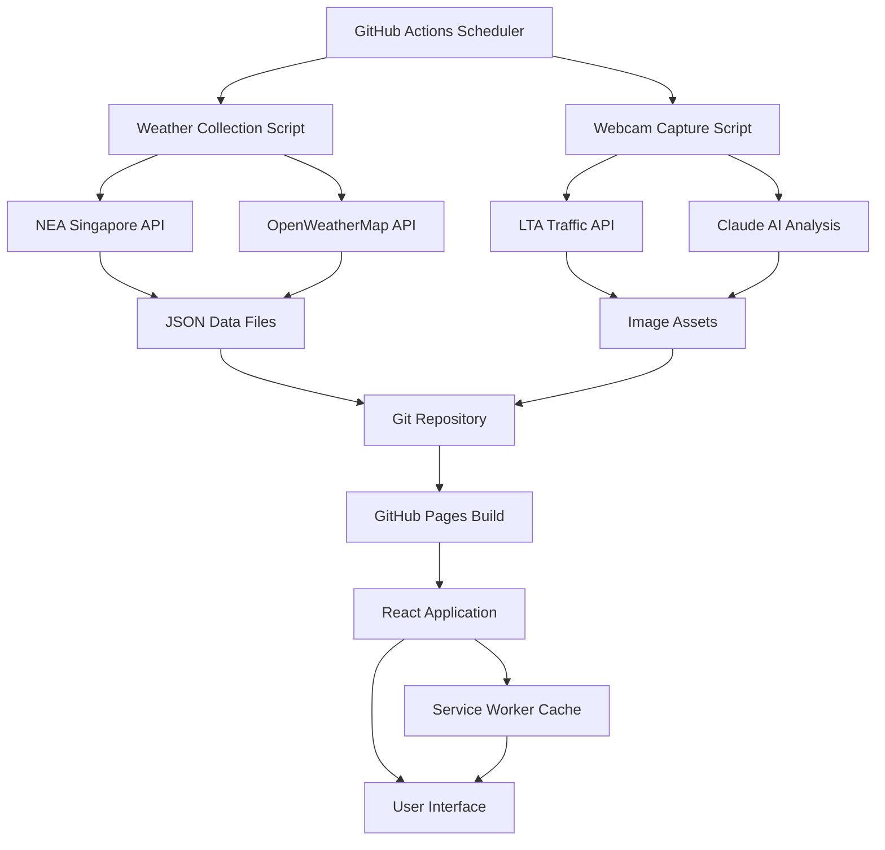

# System Architecture Documentation

## Singapore Weather Cam - Technical Architecture Overview

### Executive Summary

The Singapore Weather Cam is a modern, real-time weather and traffic monitoring application built using a **GitHub-Native JAMstack** architecture. The system provides comprehensive weather data and traffic camera feeds focused on the Bukit Timah Nature Reserve area of Singapore, delivering a responsive and accessible user experience through progressive web application (PWA) technologies.

---

## High-Level System Design

### Architecture Pattern: GitHub-Native JAMstack

```
┌─────────────────────────────────────────────────────────────┐
│                    CLIENT LAYER                             │
├─────────────────────────────────────────────────────────────┤
│  React SPA (Vite Build) → GitHub Pages (Static Hosting)    │
│  • Progressive Web App (PWA)                              │
│  • Service Worker Caching                                 │
│  • Responsive Design (Tailwind CSS)                       │
│  • Offline Capabilities                                   │
└─────────────────────────────────────────────────────────────┘
                              ↕
┌─────────────────────────────────────────────────────────────┐
│                  AUTOMATION LAYER                           │
├─────────────────────────────────────────────────────────────┤
│           GitHub Actions (Scheduled Workflows)             │
│  ┌──────────────┬────────────────┬─────────────────────┐   │
│  │ Weather      │ Webcam         │ Deployment          │   │
│  │ Collection   │ Capture        │ Pipeline            │   │
│  │ (5min cycle) │ (15min cycle)  │ (On push)           │   │
│  └──────────────┴────────────────┴─────────────────────┘   │
└─────────────────────────────────────────────────────────────┘
                              ↕
┌─────────────────────────────────────────────────────────────┐
│                   DATA LAYER                                │
├─────────────────────────────────────────────────────────────┤
│  Git Repository (Version-Controlled Data Storage)          │
│  • JSON Files (/data/weather/, /data/webcam/)             │
│  • Static Images (/public/images/webcam/)                 │
│  • Automated Commits & Versioning                         │
└─────────────────────────────────────────────────────────────┘
                              ↕
┌─────────────────────────────────────────────────────────────┐
│                EXTERNAL APIS                                │
├─────────────────────────────────────────────────────────────┤
│  • NEA Singapore (Weather Data) - Primary                  │
│  • LTA Singapore (Traffic Cameras) - Primary               │
│  • OpenWeatherMap (Backup Weather) - Optional              │
│  • Claude AI (Image Analysis) - Optional                   │
└─────────────────────────────────────────────────────────────┘
```

### Core Architectural Principles

1. **Serverless & Cost-Effective**: Zero operational costs using GitHub's free tiers
2. **Automated Data Pipeline**: Self-sustaining data collection and processing
3. **Version-Controlled Data**: All data changes tracked via Git history
4. **Progressive Enhancement**: Works offline, improves with connectivity
5. **Performance-First**: Optimized builds, caching, and lazy loading
6. **Accessibility-Driven**: WCAG 2.1 AA compliance throughout

---

## Component Architecture

### Technology Stack

| Layer | Technology | Purpose | Justification |
|-------|------------|---------|---------------|
| **Frontend** | React 18 + Vite | SPA Development | Fast development, excellent DX, modern tooling |
| **Styling** | Tailwind CSS | Utility-First CSS | Rapid prototyping, consistent design system |
| **Build System** | Vite | Module Bundling | Superior performance, ES modules, HMR |
| **Hosting** | GitHub Pages | Static Hosting | Free, reliable, integrated with repository |
| **CI/CD** | GitHub Actions | Automation | Native integration, generous free tier |
| **Data Storage** | Git + JSON | Structured Data | Version control, backup, transparency |
| **Service Worker** | Workbox Strategy | Caching & PWA | Offline support, performance optimization |
| **Maps** | Leaflet + React-Leaflet | Interactive Maps | Open source, lightweight, feature-rich |
| **State Management** | React Hooks + Context | Application State | Native React, sufficient complexity |

### System Data Flow



---

## Infrastructure Design

### Deployment Architecture

```
GitHub Repository
├── Source Code (React App)
├── Data Storage (JSON Files)
├── Static Assets (Images)
├── CI/CD Workflows
└── GitHub Pages Deployment

Production Environment:
• URL: https://username.github.io/singapore_weather_cam/
• CDN: GitHub's Global CDN
• SSL: Automatic HTTPS
• Uptime: 99.9% SLA (GitHub Pages)
```

### Data Collection Pipeline

#### Weather Data Collection
```yaml
Schedule: "*/5 * * * *"  # Every 5 minutes
Process:
  1. Fetch NEA Singapore Real-time Weather API
  2. Process & filter Bukit Timah area stations (S121, S116, S118)
  3. Transform data to application schema
  4. Generate timestamped JSON files
  5. Update latest.json with current data
  6. Commit changes with automated summary
```

#### Webcam Image Capture
```yaml
Schedule: "*/15 * * * *"  # Every 15 minutes
Process:
  1. Fetch LTA Traffic Camera API
  2. Download images from selected camera locations
  3. Optional: Claude AI image analysis and weather correlation
  4. Optimize and store images with timestamps
  5. Cleanup images older than 7 days
  6. Update metadata and commit changes
```

### Performance Optimization Strategy

#### Build Optimization
- **Code Splitting**: Feature-based chunks (vendor, react-vendor, map-vendor, etc.)
- **Tree Shaking**: Eliminate unused code with Rollup
- **Minification**: Terser with aggressive compression settings
- **Asset Optimization**: Image compression, inline thresholds
- **Bundle Analysis**: Size monitoring and warnings

#### Runtime Optimization
- **Service Worker Caching**: Network-first for data, cache-first for assets
- **Progressive Loading**: Lazy loading of non-critical components
- **Memory Management**: Efficient state management and cleanup
- **Performance Monitoring**: Built-in metrics and monitoring

---

## Security Architecture

### Security Layers

1. **Transport Security**
   - HTTPS enforced via GitHub Pages
   - Secure headers via service worker
   - CSP policies for XSS prevention

2. **API Security**
   - Environment variables for sensitive keys
   - Rate limiting through external APIs
   - Input validation and sanitization

3. **Client Security**
   - No sensitive data storage in client
   - Secure service worker implementation
   - Regular dependency updates

4. **Data Security**
   - Public data only (weather is public domain)
   - No PII collection or storage
   - Transparent data processing

### Compliance & Standards

- **WCAG 2.1 AA**: Accessibility compliance
- **GDPR Ready**: No personal data collection
- **Performance Budget**: <500KB initial, <2MB total
- **Mobile First**: Responsive design patterns

---

## Scalability Considerations

### Current Scale Targets
- **Concurrent Users**: 100-500 simultaneous users
- **Data Volume**: ~50MB/month (JSON + images)
- **API Calls**: ~10,000/month (within free tiers)
- **Build Frequency**: ~50 builds/month

### Scaling Strategies

#### Horizontal Scaling
- **CDN Distribution**: GitHub's global CDN
- **Service Worker**: Client-side caching reduces server load
- **Static Assets**: Infinite scalability for static content

#### Vertical Scaling
- **Data Optimization**: Compressed JSON, optimized images
- **Code Splitting**: Faster initial loads
- **Lazy Loading**: Reduced initial bundle size

#### Growth Path
1. **Phase 1**: Current GitHub-native setup (0-1000 users)
2. **Phase 2**: Add CDN optimization (1000-5000 users)
3. **Phase 3**: Migrate to dedicated infrastructure (5000+ users)

---

## Monitoring & Observability

### Built-in Monitoring
- **GitHub Actions Logs**: Automated workflow monitoring
- **Performance Metrics**: Built-in React performance tracking
- **Error Boundaries**: Component-level error isolation
- **Service Worker Logs**: Caching and network monitoring

### Quality Metrics
- **Lighthouse Scores**: Performance, accessibility, SEO
- **Core Web Vitals**: LCP, FID, CLS tracking
- **Bundle Analysis**: Size and dependency monitoring
- **Test Coverage**: Unit, integration, and E2E testing

### Alerting Strategy
- **Workflow Failures**: GitHub notifications
- **Performance Degradation**: Lighthouse CI alerts
- **Dependency Vulnerabilities**: Dependabot alerts
- **Uptime Monitoring**: GitHub Pages status

---

## Risk Assessment & Mitigation

### Technical Risks

| Risk | Impact | Probability | Mitigation |
|------|--------|-------------|------------|
| GitHub Actions quota exceeded | High | Medium | Usage monitoring, workflow optimization |
| API rate limits | Medium | Low | Multiple data sources, caching |
| Service outage | Medium | Low | Service worker offline support |
| Data corruption | Low | Low | Git version control, automated backups |

### Business Continuity
- **Disaster Recovery**: Git history provides complete restoration
- **Data Backup**: Distributed across GitHub's infrastructure
- **Rollback Capability**: Git-based deployment enables instant rollbacks
- **Alternative APIs**: Multiple data sources prevent single points of failure

---

## Development Workflow

### Environment Strategy
```yaml
Development:
  - Local Vite dev server
  - Hot module replacement
  - Mock data fallbacks
  - Full feature access

Staging:
  - GitHub Pages preview
  - Real API integration
  - Performance testing
  - Accessibility validation

Production:
  - GitHub Pages main
  - Automated deployment
  - Monitoring active
  - Performance optimized
```

### Code Quality Pipeline
1. **Pre-commit**: ESLint, Prettier, type checking
2. **Build**: Vite build validation, bundle analysis
3. **Test**: Unit tests, integration tests, E2E tests
4. **Deploy**: Automated deployment with rollback capability

---

## Future Architecture Evolution

### Short-term Enhancements (3-6 months)
- Enhanced caching strategies
- Additional data sources integration
- Advanced analytics and reporting
- Mobile app consideration

### Long-term Evolution (6-12 months)
- Microservices architecture consideration
- Real-time WebSocket connections
- Advanced AI/ML integration
- Multi-region deployment

### Technology Refresh Strategy
- React ecosystem updates (quarterly)
- Security dependency updates (monthly)
- Performance optimization reviews (bi-annual)
- Architecture pattern reviews (annual)

---

*This document is part of the Singapore Weather Cam technical documentation suite. For implementation details, see COMPONENT_ARCHITECTURE.md and DESIGN_PATTERNS.md.*